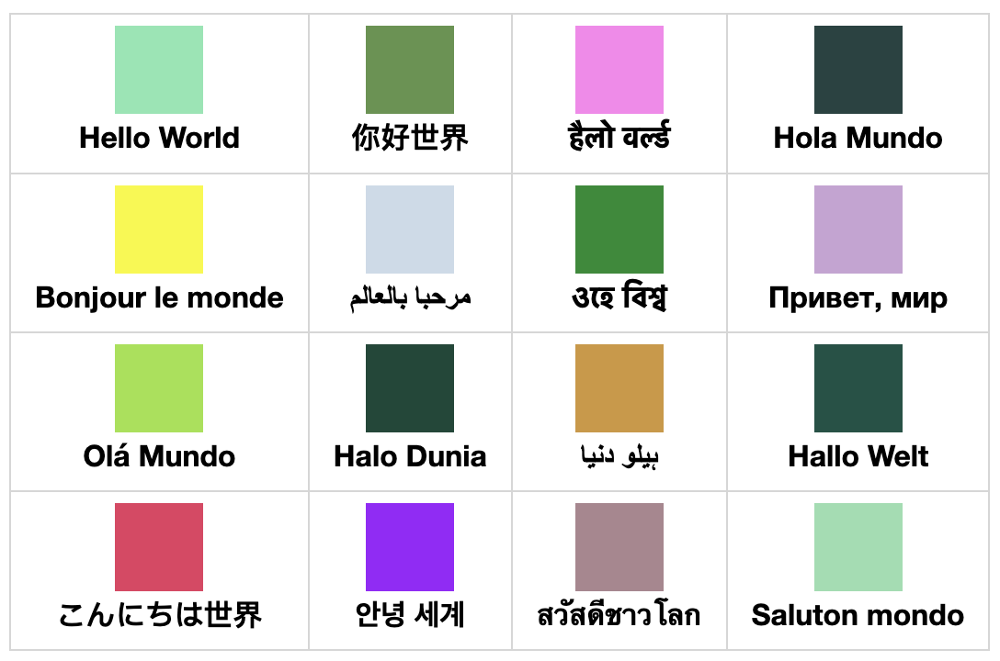

# text-rgb
Create rgb tuple from a string of text
## Install
```shell
npm install @beonfu/text-rgb
```

## Usage

```javascript
import { rgb, rgbString, rgbaString } from '@beonfu/text-rgb'

rgb('Hello World') // [133, 230, 177]

rgbString('Hello World') // "rgb(133,230,177)"

rgbaString('Hello World', 1) // "rgba(133,230,177,1)"
```

The principle is to divide the text into three parts, and then take the remainder of 256 after accumulating the sum of charCode
So there is no randomness

```javascript
rgb('Hello World') === rgb('Hello World') // true
```

## Hello World RGB
In addition to the functions of the function itself, I also want to share some interesting content



## PackageName
Why use `@boenfu/text-rgb` instead of `text-rgb` ?
> npm ERR! 403 403 Forbidden - PUT https://registry.npmjs.org/text-rgb - Package name too similar to existing package [textrgb](https://www.npmjs.com/package/textrgb); try renaming your package to '@boenfu/text-rgb' and publishing with 'npm publish --access=public' instead

## License
[MIT](./LICENSE)
